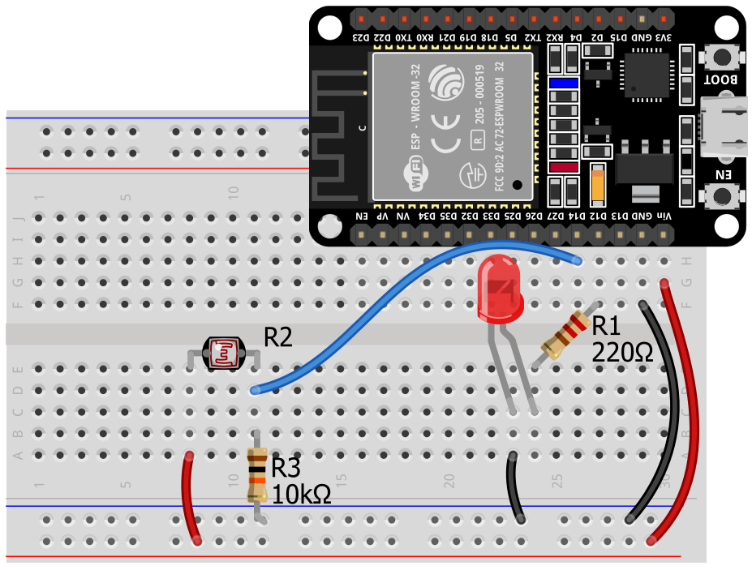

**Shortiquiz** is an extension for [Quarto](https://quarto.org/) that allows you to add interactive quiz questions to your website pages: multiple-choice questions, text input fields, Parsons problems, flashcards, and much more.


## Installation

Add the extension to your Quarto project:

```bash
quarto add skyfroger/shortiquiz
```

After installation, shortcodes will be available immediately, while filters will require connecting `shortiquiz` to the entire project or to a specific page (as in the YAML header of this document).

## Localization

To localize the extension's UI elements, specify the `lang` attribute in YAML. English is used by default. Russian is also available:

```yaml
lang: ru
```

## Shortcodes

Shortcodes allow you to embed interactive elements directly into paragraph text.

### `qselect` — dropdown list

Adds a dropdown list with answer options. The **first** specified option is considered correct; options are shuffled before being displayed.

**Parameters:**

| Parameter | Description |
|-----------|-------------|
| *(first argument)* | Answer options separated by `|`. The first one is correct. |
| `show` | Text that will be displayed after the correct answer. |
| `mono` | If `true`, the answer is displayed in a monospaced font. |


:::{.callout-note title="Answer color"}
If the correct answer is given on the first attempt, the text is highlighted in **green**; otherwise, it is **blue**.
:::

**Demo:**

In Python, the function for converting to an integer is .


### `qinput` — text input field

Adds a text input field for entering an answer. Validation occurs when `Enter` is pressed or when the field loses focus.

**Parameters:**

| Parameter | Description |
|-----------|-------------|
| *(first argument)* | Correct answer options separated by `|`. The first one is used for display if `show` is not set. |
| `tol` | Tolerance for numeric answers. A value in the range `n - tol <= answer <= n + tol` is considered correct. |
| `show` | Text to display in place of the input field after a correct answer. |
| `hints` | Hint text that appears after three incorrect attempts. |
| `mono` | Monospaced font for displaying the correct answer. |
| `size` | Width of the input field (the `size` attribute of the `<input>` tag). Default is `2`. |

**Demo 1 — text answer:**

Consider a PWM signal with a 50% duty cycle. If the reference voltage is 5 V, the average output voltage will be  Volts.

**Demo 2 — numeric answer with tolerance:**

Enter a number from 8 to 12: .


## Block questions

### Multiple-choice question (`qmulti`)

The question is placed inside a block with the `.qmulti` class. All text before the list is the question text, list items are answer options. The **first item is considered correct.** Options are shuffled when the page is rendered.

**Demo — minimal question:**

:::{.qmulti}

How can you determine the type of a variable?

- Use the `type` function.
- Print the variable's value to the screen and determine its type from the result.
- Use it in an expression whose value is known.
- Look at the variable's description.

:::

**Demo — with hints and feedback:**

:::{.qmulti}

What value will be printed:

```python
print(int(53.785))
```

> What is the easiest way to get a real number from an integer?

- 53

  > The number 53.785 is converted to an integer by the `int` function. The fractional part of the original number is discarded.

- A runtime error will occur.

  > There are no syntax errors in this expression.

- 54

  > The `int` function does not round real numbers.

- 53.785

  > The `int` function converts a number to an integer.

:::


### Open-ended question (`qinput`)

A block with the `.qinput` class is used for an open-ended question. The first list item is the correct answer.

**Demo:**

:::{.qinput}

What will be the result of executing the code:

```python
print(42)
```

> Pay attention to what is written in the parentheses.

- 42

- 24

  > The digits are swapped.

:::


### Question with multiple correct answers (`qcheck`)

A block with the `.qcheck` class contains a checklist (`- [ ]` / `- [x]`). Correct options are marked with an `x`.

**Demo — minimal question:**

:::{.qcheck}

Select the options with valid Python variable names.

- [x] `sum`
- [ ] `1st_name`
- [ ] `class`
- [x] `_last_name`
- [x] `Student`

:::

**Demo — with feedback:**

:::{.qcheck}

Which of the following is a logical expression?

- [x] `True`

  > `True` and `False` are boolean literals. They can be considered logical expressions.

- [x] `3 == 4`

  > The result of a comparison using `==` is either `True` or `False`.

- [ ] `3 + 4`

  > The value of this expression is a number.

- [x] `3 + 4 == 7`

  > The expression 3+4 equals 7. `7 == 7` is a logical expression.

- [ ] `"False"`

  > The value is in double quotes, so it is a string.

:::


### Parsons problems (`qparson`)

An exercise in which you need to arrange lines of code in the correct order.

**Attributes:**

| Attribute | Description |
|-----------|-------------|
| `spaces` | Number of spaces in indentation. Default is `4`. |
| `sep` | Arbitrary separator for combining adjacent lines into a single instruction block. |

**Demo — basic markup:**

:::{.qparson spaces=4}

Arrange the lines of code in the correct order so that the program prints numbers from `n` down to 1.

```python
n = int(input('Enter a number'))
while n > 0:
    print(n)
    n = n - 1
```

:::

**Demo — with line combining (`sep`):**

:::{.qparson sep=##}

```python
n = int(input("n>"))
sum = 0##
while n > 0:##
    if n % 2 == 0:##
        print(n)
        n = n - 1##
```

:::

**Demo — with distractors:**

:::{.qparson spaces=4 sep=##}

```python
n = int(input())
sum = 0##
while n > 0:##
    if n % 2 == 0:##
        print(n)
        n = n - 1##
```

```py
n = int(input())
sum = 1##
```

:::


### Image area selection (`qspot`)

The user is asked to drag numbered markers to the correct image areas.

**The `pos`** attribute specifies the coordinates of the area in the format `x y width height`.

> **Note:** For the demo to work correctly, replace `example.assets/img.png` with the actual path to the image in your project.

```markdown
:::{.qgroup}

:::{.qspot}



Find the following elements in the image:

[photoresistor]{pos="57 24 12 12"}

[red LED]{pos="43 61 13 31"}

[microcontroller]{pos="1 41 58 42"}

> Hint to the question.

:::
```

**Demo:**

:::{.qspot}


Find the following elements in the image:

[photoresistor]{pos="57 24 12 12"}

[red LED]{pos="43 61 13 31"}

[microcontroller]{pos="1 41 58 42"}

> Hint to the question.

:::

## Additional features

### Grouping questions (`qgroup`)

Several consecutive questions can be grouped together:

:::{.qgroup}

:::{.qmulti}

What type of data does `input()` return?

- `str`
- `int`
- `float`
- `bool`

:::

:::{.qcheck}

Which of these names are valid in Python?

- [x] `value_1`
- [ ] `1value`
- [x] `_temp`
- [ ] `for`

:::

:::

### Stage unlocking (`qgate` + `qnext`)

Step-by-step instructions where each next stage opens only after a button is clicked.

::::{.qgate name=step1}

### Stage 1: Preparation

Make sure you have Python version 3.10 or higher installed.



::::

::::{.qgate name=step2}

### Stage 2: Installing the library

Run in the terminal:

```bash
pip install requests
```



::::

::::{.qgate name=step3}

### Stage 3: Verification

Make sure the installation was successful:

```python
import requests
print(requests.__version__)
```

This is the final stage of the instructions.

::::

### Solution hints (`qsolution`)

The `.qsolution` block contains sequential hints for solving a problem. Each hint is an item in an ordered or unordered list.

- Hints open **sequentially** (one at a time).
- If there is a code block inside the `.qsolution` block, it is considered the **solution to the problem**.
- The solution is only available after all hints have been opened.
- The lines of the solution code are initially hidden and open one at a time; after the tenth line, the entire code can be opened.

**Demo:**

:::{.qsolution}

1. Use the cascading form of the conditional statement.
2. Note that winter months are numbered 1, 2, and 12.
3. It is sufficient to write logical expressions for three seasons. If none of the three conditions are met, the `else` branch for the remaining last season will execute. This will shorten the code.

```python
month = int(input("Enter the month number (from 1 to 12): "))

if month == 1 or month == 2 or month == 12:
    print("Winter")
elif month >=3 and month <=5:
    print("Spring")
elif month >= 6 and month <= 8:
    print("Summer")
else:
    print("Autumn")
```

:::

### Flashcards (`qflashcards`)

A set of cards with questions and answers. The student reads the question, recalls the answer, and then checks themselves. If they cannot recall the answer, the card is added to the end of the deck.

**Demo:**

:::{.qflashcards}

- Function for printing values to the screen.

  > `print()`

- Function for reading values from the keyboard.

  > `input()`

- What type of value does the `input()` function return?

  > String (`str`)

- Function for converting values to integers.

  > `int()`

:::

### Question card (`qflip`)

An interactive card with two sides: a question and an answer. Clicking on the card flips it.

**Demo:**

:::{.qflip}

Which function can be used to read a value from an analog pin on Arduino?

---

```c++
analogRead(pin);
```

:::


## Markup tips

1. **The correct answer is always first.** In `qmulti`, `qinput` (block), and `qselect`, the first specified option is considered correct. In `qcheck`, correctness is set via `[x]`.
2. **Shuffling.** In `qmulti` and `qselect`, answer options are automatically shuffled before being displayed.
3. **Hints and feedback.** Use blockquotes `>` to add explanations. The placement of the quote (before the list or inside an item) determines its purpose.
4. **Code inside questions.** Quarto supports syntax highlighting inside question blocks — use fenced code blocks (```` ``` ````).
5. **Block nesting.** For `qgroup` and `qgate`, use 4 colons (`::::`) for the outer block to avoid conflicts with inner blocks of 3 colons (`:::`).
6. **Filter in YAML.** Don't forget to add `filters: - shortiquiz` to the document header, otherwise block questions will not work.
